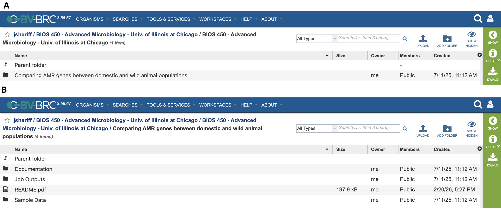

========

Introduction
---------------------------
In congruence with servicing the biomedical research community via the development of robust, bioinformatic tools and services, the BV-BRC is equally commited to servicing the needs of our ever-growing community of educators. The *BV-BRC for Educators* community was formally organized to create a centralized network for the creation and publication of educational workspaces, exercises, and workflows by educators, for educators. *BV-BRC for Educators* will be used to support our educational community through:

* **Accessiblity**. The BV-BRC provides users with free bioinformatic resources, open to all students and instructors registered with the platform. 
* **Reproducibility**. The sharing of educational material through public workspaces allows for open access of workflows, exercise documents, and sample data, providing consistent results for both instructors and students. 
* **A GUI Platform**. Our platform prides itself on providing users with dozens of bioinformatic tools, along with millions of curated bacterial and viral genomes, within a simple, graphical user interface. Concomitantly, this provides our educational community with a means of integrating bioinformatics into their course curricula without requiring the prerequisites necessary for using traditional bioinformatic tools, such as statistics and experience utilizing a command line interface. 
* **Internally-Managed HPC Systems**. Housed at Argonne National Lab, the high-performance computing systems used for running the BV-BRC analytical services are managed autonomously, allowing instructors to support large class sizes without needing to consider how to allocate their available computing power. 
* **Support**. Most importantly, the BV-BRC team is readily available to provide support to eductors through our long-standing ticket submission system, as well as our BV-BRC Community Slack Channel. 

Create and Publish an Education Workspace
----------------------------------------------------------

**1) Creating a Workspace**

Like a normal workspace, creating an education workspace follows the same process. A step-by-step walkthrough for creating a new workspace can be accessed `here <https://www.bv-brc.org/docs//quick_references/workspaces/workspace.html>`_.

**2) Organizing Your Content**

Although we do not have strict guidelines, to ease the use of your workspace by instructors and students, we **highly recommend** following our recommended format. 

   
The images above provide an example layout for organizing your education workspace. This public education workspace can be accessed `here <https://www.bv-brc.org/workspace/jsheriff@bvbrc/BIOS%20450%20-%20Advanced%20Microbiology%20-%20Univ.%20of%20Illinois%20at%20Chicago/BIOS%20450%20-%20Advanced%20Microbiology%20-%20Univ.%20of%20Illinois%20at%20Chicago>`_. 

Image **A** shows the contents of the primary, course-level directory for the workspace, titled: "BIOS 450 - Advanced Microbiology - Univ. of Illinois at Chicago". To provide other educators with minimal context on the contents of your workspace, the workspace title should include the course nomenclature - the course title - the course's institution. This directory is where your exercise directories are stored, with each each exercise having its own directory. In this case, there is only one execerise included in this public education workspace. 

Image **B** shows the contents of the secondary, exercise-level directory, titled: "Comparing AMR genes between domestic and wild animal populations". The title should be that of the exercise itself. All exercise directories share the same, following recommended format:

* **Documentation** directory - contains all the necessary documentation for the exercise, such as exercise handouts, exercise questions, and relevant powerpoint slides. Whatever material your students require to be able to successfully complete the exercise is what should be uploaded to this directory. 

* **Job Outputs** directory - contains the *example* job outputs for your exercise. Example job outputs are excellent for those who wish to do a live walkthrough the exercise with your class, allowing your class to practicing submitting analysis jobs, yet not having to wait for the job to finish running in order to walkthrough interpreting the job results. Test jobs or any job results that may give away unwanted answers to your exercise, should be excluded from this directory.

* **Sample Data** directory - contains all the necessary sample data files needed to complete the exercise, such raw reads (FASTQ files), contigs (FASTA files), genome groups, or feature groups. 

* **README** File - required for **each** exercise, the README file contains the background information and learning objectives of the exercise, as well as a brief description of all directories and files within the exercise directory. README files can be uploaded as either docx or pdf files. To make searching workspaces easier for other insructors, we recommend uploading the README as a PDF, since viewing PDF files is supported directly within the BV-BRC workspace. Docx files will need to be downloaded to view. 

A README Template docx file can be downloaded from `here <https://docs.google.com/document/d/1Jd5J82dnqWuW_2xU6ZwcAzKIKpX-e4Xj/edit?usp=sharing&ouid=108904723406190559319&rtpof=true&sd=true>`_. An example README file for the above exercise can be viewed `here <https://www.bv-brc.org/workspace/jsheriff@bvbrc/BIOS%20450%20-%20Advanced%20Microbiology%20-%20Univ.%20of%20Illinois%20at%20Chicago/BIOS%20450%20-%20Advanced%20Microbiology%20-%20Univ.%20of%20Illinois%20at%20Chicago/Comparing%20AMR%20genes%20between%20domestic%20and%20wild%20animal%20populations/README.pdf>`_.

Additionally, the contents of the README file can be copied and pasted with the prompt provided below:

"

The educator workspace ReadME file is designed to provide a general overview of the exercise, facilitating the sharing and use of BV-BRC exercises among the educator community. To publish an educator workspace, a ReadMe file is **required for each exercise within a workspace**, with the following information included:

**Corresponding Educator(s)**: the name, email, and institution of at least one educator to contact regarding the exercise.

**Overview**: a brief overview of the exercise

**Learning Objectives**: the learning objectives and goals of the exercise

**Files**: a list of folders and files included within the exercise. Each exercise should be organized into three folders: (1) Documentation, (2) Job Outputs, and (3) Sample Data. 

**Services**: Services used for this exercise

**References**: Any sources used to develop this exercise (e.g., non-BV-BRC tools, sample data, related publications, etc.)

======================================

**Corresponding Educator(s)**

[Insert list of corresponding educators]

**Overview**

[Insert description of exercise overview]

**Learning Objectives** 

[Insert learning objective 1]

**Files**

* Documentation
   * [File name/directory name: brief file description]

* Job Outputs
   * [File name/directory name: brief file description]

* Sample Data
   * [File name/directory name: brief file description]

**Services**

[Insert service(s) used] 

**References**

[Insert bibliography for necessary references (e.g., references for published sample data)]

"

**3) Publishing Your Workspace**

Currently, publishing an education workspace is done in the same fashion as pubicizing a regular, private workspace. A step-by-step tutorial on publishing a private workspace can be accessed `here <https://www.bv-brc.org/docs//quick_references/workspaces/workspace.html>`_.

**4) Notifying the BV-BRC**

Once you have published your education workspace, you will need to contact the BV-BRC in order to have your workspace added to our list of public education workspaces (see **Accessing Education Workspaces** below). You can contact us via two ways:

   **a. Directly email a BV-BRC outreach team member**.
   Contact a member of our outreach team to let us know you wish to have your workspace added to the public list. Be sure to include the title of your workspace within your email, and ensure that the workspace contains the required material as outlined above. With your request, you may reach out to:

      Jamal Sheriff, jsheri6@uic.edu

      Rachel Poretsky, microbe@uic.edu

   **b. Through the BV-BRC Community Slack Workspace**. 
   You can also send your requests as a direct message through Slack to either Jamal Sheriff or Rachel Poretsky, or post your request directly to the #education channel. Find information on how to join the BV-BRC Community Slack below (see **Getting Help** below). 

Accessing Education Workspaces
------------------------------------------
All public education workspaces can be found within the inventory of `publc workspaces <https://www.bv-brc.org/workspace/public>`_ located on our website. Below, you can find the current list of public education workspaces being hosted. Don't see your education workspace on here? Please contact us!

.. list-table:: Sample List-Table
   :widths: 50 50
   :header-rows: 1

   * - Workspace Title
     - Publisher
   * - `BIOS 450 - Advanced Microbiology - Univ. of Illinois at Chicago <https://www.bv-brc.org/workspace/jsheriff@bvbrc/BIOS%20450%20-%20Advanced%20Microbiology%20-%20Univ.%20of%20Illinois%20at%20Chicago/BIOS%20450%20-%20Advanced%20Microbiology%20-%20Univ.%20of%20Illinois%20at%20Chicago>`_
     - Jamal Sheriff
   * - Row 2, Column 1
     - Row 2, Column 2

Getting Help
------------------------------------------

