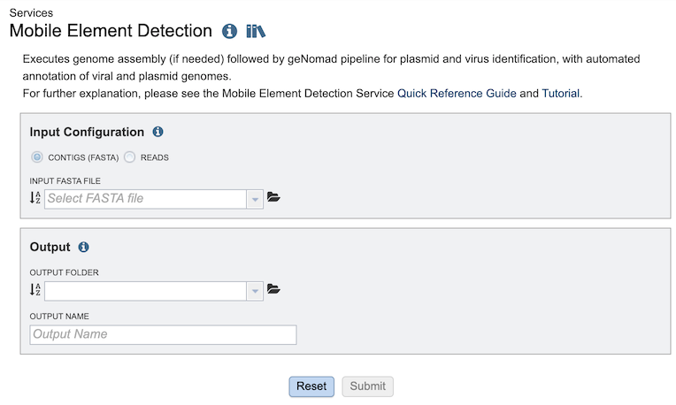

# Mobile Element Detection Service 

*Revised: April 6, 2026*

## Overview
The Mobile Element Detection service allows you to identify viruses and plasmids in nucleic acid datasets. The use cases for this pipeline are broad – from detecting novel viruses in complex wastewater samples, to identifying plasmids in isolate genomes. The core of the Mobile Element Detection service is [geNomad](https://portal.nersc.gov/genomad/index.html) which detects viruses and plasmids in assembled contigs. This pipeline can accept short reads or assembled contigs. If raw reads are provided, assembly can be carried out using any of the assembly methods in the [Genome Assembly Service](https://www.bv-brc.org/docs/tutorial/genome_assembly/assembly.html). The output of this pipeline is an assembled contigs file (if short reads are provided) and a tailored geNomad output which links identified viral and plasmid resources to BV-BRC databases.

## See also
* [Mobile Element Detection Service](https://www.bv-brc.org/app/MobileElementDetection)

## Using the Mobile Element Detection Service
The **Mobile Element Detection** submenu option under the **Services** main menu (Metagenomics category) opens the service input form (*shown below*). *Note: You must be logged into BV-BRC to use this tool.*

## Options
 

## From 
Dropdown list for electing which ID type (BV-BRC, RefSeq, Uniprot-KB, etc.) to map from (source).

## To 
Dropdown list for selecting which ID type (BV-BRC, RefSeq, Uniprot-KB, etc.) to map to (target). 

## IDs
Input box for specifying the IDs to map.  The IDs can be specified in a comma-separated or one-per-line list.

## Feature Strategy 
This tool uses the Uniprot-KB mapping table to map external IDs to BV-BRC. This is done using NCBI IDs. Due to updates over time some NCBI IDs may achieve better mapping results than others. 

## Buttons
**Map:** Launches the mapping service, which, upon completion, displays a table below it 

## Output Results
 

The ID Mapper Service generates a table containing all the matching items (e.g., features, genomes, etc.) that map to the list of IDs provided. The input IDs appear in the Source column and matching IDs in the Target column. Every feature may not have a matching ID in the target ID type.

### Action buttons
After selecting one of the output features by clicking it, a set of options becomes available in the vertical green Action Bar on the right side of the table.  These include

* **Hide/Show:** Toggles (hides) the right-hand side Details Pane.
* **Download:**  Downloads the selected items (rows).
* **Copy:** Copies the selected items to the clipboard.
* **FASTA:** Provides the FASTA DNA or protein sequence for the selected feature(s).
* **ID Map:** Provides the option to map the selected feature(s) to multiple other idenfiers, such as RefSeq and UniProt.
* **MSA:** Launches the Multiple Sequence Alignment (MSA) tool and aligns the selected features by DNA or protein sequence in an interactive viewer.
* **Pathway:** Loads the Pathway Summary Table containing a list of all the pathways in which the selected features are found.
* **Group:** Opens a pop-up window to enable adding the selected sequences to an existing or new group in the private workspace.
* **Feature:** Loads the Feature Page for the selected feature. *Available only if a single feature is selected.*
* **Features:** Loads the Features Table for the selected features. *Available only if multiple features are selected.*
* **Genome:** Loads the Genome View Overview page corresponding to the selected feature.  *Available only if a single feature is selected.*
* **Genomes:** Loads the Genomes Table, listing the genomes that correspond to the selected features. *Available only if multiple features are selected.*

More details are available in the [Action Bar](/quick_references/action_bar) Quick Reference Guide.

