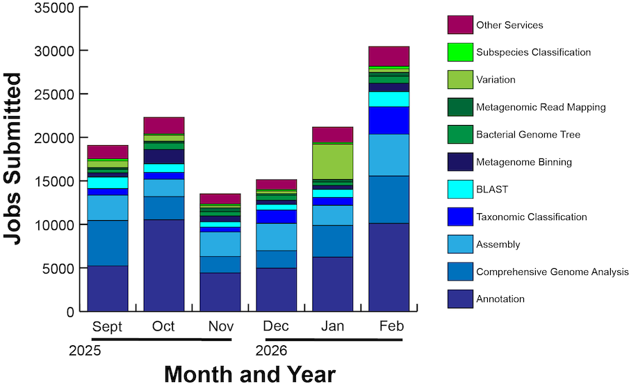

# Usage Metrics
For February 2026, unless otherwise noted

| Metric                                          | Value     |
| :---------------------------------------------  | :-------: |
| Total registered users                          |    76,916 |
| Analysis jobs submitted by users                |	   19,914 |
| Registered users that run a service             |     1,543 |
| Total storage used for user data (TB)           |     820.6 |
| Total site visits                               |    88,588 |
| Total unique visitors (avg/month)               |    56,142 |
| Total pageviews                                 |   224,533 |                      
| Avg. pages / visit                              |      2.53 |
| Avg. visits / visitor                           |      1.57 |
| Avg. visit duration (seconds)                   |       239 | 
| Citations to BV-BRC publications (cumulative)   |    29,340 |

 
 

**Analysis jobs submitted by users, by type**

